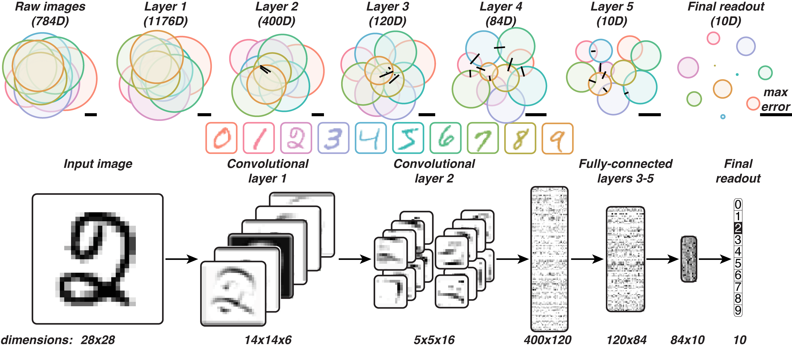

# hypersphere2sphere (h2s)
*(Python implementation is in development — watch this space)*

hypersphere2sphere(h2s) is a visualization method for conveying the relationships between high-dimensional, labeled data distributions. h2s summarizes each labeled distribution as a sphere (in 3D) or circle (in 2D).

<p align="center">
  
  <br>
  <i>h2s can visualize, for example, the activations in each layer of a convolutional neural network to images of handwritten (MNIST) digits.</i><br>
</p>

## Basics

The h2s algorithm proceeds in two steps:

<p align="center">
  
  <br>
  <i>h2s fits hyperspheres enclosing high-dimensional, labeled data distributions and represents them in a low-dimensional visualization space, either perfectly (a), or approximately (b).</i><br>
</p>


### Step 1: High-dimensional hypersphere estimation
A uniform *N*-ball distribution is fit to the distribution of samples from each category, yielding a center (a *N*-vector) and a radius (a scalar) for each category [[1]](#Ritter1990)[[2]](#Larsson2008).

Here `data` is either an [*P* by *N*] matrix or [*P* by *N* by *F*] tensor, where *P* is the number of points (or "samples"), *N* is the dimensionality of the points, and for dynamic data, *F* is the number of frames (or samples in time).

```matlab
data % an [P by N] or [P by N by F] matrix
% create a Hypersphere object of the high-dimensional representation of the data
hi = Hypersphere.estimate(data);
```

The result is a `Hypersphere` object which contains an estimate of the center and radius of the distribution.

```matlab
>> hi

hi =

  Hypersphere with properties:

                 centers: [-0.0064 -0.0232 0.0145]
                   radii: 1.9138
              categories: [1x1 Categories]
                 distsCV: 0
    belongsToCommonSpace: 0

>> hi.categories

ans =

  Categories with properties:

        labels: {'category 1'}
        colors: [0.9647 0.5333 0.6235]
       vectors: []
    ispermuted: 0
```

Running `Hypersphere.estimate` with only one argument assumes that all the data belong to a single label/distribution. You may notice in the `Hypersphere` object, another `Categories` object within it, here in `hi.categories`. This was automatically generated, but you can alternatively specify the labels of each point by first creating your own `Categories` object.

```matlab
cats = Categories(vectors);
```

A minimal `Categories` object simply takes in `vectors`, a [*P* by *C*] logical matrix where *C* is the number of categories, and the (*p*,*c*)th element in the matrix is `true` if the *p*th point belongs to the *c*th category. This matrix is stored in `Categories.vectors`. Labels and colors can be optionally specified in the same object, in `Categories.labels` and `Categories.colors`, respectively.

```matlab
cats = Categories(vectors,labels,colors);
hi = Hypersphere.estimate(data,cats); % cats is now embedded in hi
```

Each of the hyperspheres estimated are in this single `Hypersphere` object. Things are more interesting now, however, with multiple labels. The `Hypersphere` object can lazily compute the statistics of interest that are used to optimize the visualization's appearance in step 2.

```matlab
>> hi

hi =

  Hypersphere with properties:

                 centers: [4x3 double]
                   radii: [0.9997 0.9887 0.9116 1.0366]
              categories: [1x1 Categories]
                 distsCV: [4.7799 4.7237 4.4646 4.0461 4.1909 4.2194]
    belongsToCommonSpace: 0

>> hi.overlap

ans =

   -0.2063   -0.2681   -0.0780   -0.1227   -0.0338   -0.1100

>> hi.categories

ans =

  Categories with properties:

        labels: {'category 1'  'category 2'  'category 3'  'category 4'}
        colors: [4x3 double]
       vectors: [200x4 logical]
    ispermuted: 0
```

For reference, you can also plot the original points with the colors specified in the `Categories` object. You can also generate new samples from the estimated distributions.

```matlab
% plot the first 2 or 3 dimensions of the original data
hi.plotSamples(data);
% generate arbitrary samples from the hypersphere distributions
hi.plotSamples(100); % 100 samples per hypersphere
```

### Step 2: Optimization of low-dimensional rendering
If the number of categories *C* is no greater than *n+1* (e.g., for up to 4 categories for a 3d visualization), the hyperspheres' parameters can be perfectly expressed by the visual language of spheres (or circles for a 2d visualization). If *C>n+1*, then a perfect expression of the summary statistics is not in general possible, and the sphere parameters are optimized to best express the hypersphere parameters.

For the second step, H2S initializes the low-dimensional sphere embedding by positioning the sphere centers using MDS with metric stress [[3]](#Young1938)[[4]](#Torgerson1952)[[5]](#Shepard1962) as the optimization criterion. The sphere embedding configuration is further optimized to minimize the error *E* between the visualized spreads , separation distances , and overlaps, *&otilde;*, and the target values measured in the high-dimensional space (*&scirc;*, , and *&ocirc;*,  respectively):

<p align="center">
  
</p>

This step yields a `SetOfHyps` object (it can be run on a `Hypersphere` or `SetOfHyps` object), which is a subclass of `Hypersphere` that inherits its methods and has additional methods and properties related to h2s optimization, display, and statistical inference. Some properties, such as centers and radii, are protected in `SetOfHyps`, and several other properties (such as overlaps) are eagerly computed and stored in the object.


```matlab
% Run the h2s algorithm to create a low-dimensional representation (converts to a SetOfHyps object)
lo = hi.h2s;       % 3D by default, but...
lo2d = hi.h2s(2);  % ...you can specify a 2D representation

% Render the visualization
lo.show;

% If you so desire, you can do it all in one line:
Hypersphere.estimate(data,cats).show; % (show runs h2s automatically if there are too many dimensions)
```

<p align="center">
  
  <br>
  <i>Another fit of the 2-dimensional representation from (b) in the h2s algorithm figure above. The ground truth generating 3d data had all 4 spheres touching at a single point each -- a configuration that is impossible to perfectly represent in 2d.</i><br>
</p>

The H2S visualization may display a black line in the lower right corner. This is an error bar: it represents the maximum error of any of the spread, separation, and overlap terms in the equation above. If H2S arranges the visualization in a way that fails to capture the sign of an overlap/margin correctly, it will place a black line above that overlap to indicate that it is truly a margin, or vice-versa. The `msflips` property identifies which of these overlap/margins have flipped. The black error lines are plotted only if both a given `msflips` overlap/margin is true and the original overlap/margin was significant (see below for significance testing).

```matlab
>> lo

lo =

  SetOfHyps with properties:

                  volume: [2.9789 2.7970 2.3485 3.0537]
                   dists: [2.5796 1.8628 1.7991 1.6846 1.7080 2.4028]
                 margins: [0.6623 0.0245 -0.1605 -0.1235 -0.2215 0.5523]
                      ci: [1x1 struct]
                   error: [1x16 double]
                     sig: [1x1 struct]
                    sigp: [1x1 struct]
                 sigdiff: [1x1 struct]
                sigdiffp: [1x1 struct]
                 msflips: [0 0 1 1 1 0]
                 overlap: [-0.6623 -0.0245 0.1605 0.1235 0.2215 -0.5523]
                 centers: [4x2 double]
                   radii: [0.9738 0.9436 0.8646 0.9859]
              categories: [1x1 Categories]
                 distsCV: 0
    belongsToCommonSpace: 0
```


## Getting fancy: user options for estimation and optimization

### Estimation options

The default estimator for the high-dimensional hypersphere parameters is an empirically-derived one which automatically selects the more appropriate of two Minimum Variance Unbiased Estimators (MVUE), one which makes a hyperspherical assumption, and another which makes a Gaussian assumption. If so desired, an alternative estimator can be used, such as one that maximizes the likelihood of a minimally enclosing hypersphere (`'jointml'`), an Markov Chain Monte Carlo (`'mcmc'`) search for the parameters that maximize the posterior probability of the data under the assumption of a uniform *N*-ball distribution, or the MVUEs which make specific distributional assumptions (`'gaussian'`, `'uniformball'`, `'uniformcube'`).

```matlab
hi = Hypersphere.estimate(data,cats,'mcmc');
```

### H2S optimization options

By default, H2S initializes the low-dimensional sphere embedding by positioning the sphere centers using MDS with metric stress. One can explicitly call for this with the `'mdsinit'` option or, alternatively, use random initializations with `'randinit'`.

```matlab
% runs 10 optimizations with random initializations,
% selects the one with the lowest error.
% the preceding 3 indicates the visualization dimensionality
lo = hi.h2s('randinit',[3 10]);
```

To create an H2S visualization that copies the estimated radii rather than optimizing them jointly with the other summary statistics, one can use regularization terms on a generalized form of the H2S objective:

<p align="center">
  
</p>

```matlab
% disables radius optimization by setting {alpha=1, beta=1, gamma=0}:
lo = hi.h2s({1 1 0});
```

Note that the standard `'mdsinit'` initialization is the global optimum of this reduced objective function.


## Going deeper: statistical inference

The H2S framework can also report statistical significance for each individual summary statistic, and significant differences between them. These are permutation- and bootstrap-based tests that are applied to the high-dimensional data. The output is a `SetOfHyps` object.

```matlab
hi = hi.significance(points); % points is a required input

figure;
ax(1) = subplot(1,3,1);
hi.showSig;           % plots diagram of significance values for each statistic
hi.showSig('legend'); % same as above, but includes a legend indicating thresholded significance values

ax(2) = subplot(1,3,2);
hi.showSig('diff');   % plots diagram of significance of differences among the statistics

% alternatively, this plots both in one line:
hi.showSig(ax);

% you can use the same visualization format to plot the values of the statistics of interest themselves:
ax(3) = subplot(1,3,3);
hi.showValues;

% or plot both the high and low-dimensional values together for comparison
hi.showValues(lo);
```

## Adding time: dynamics

If you have dynamic data in the form of a [*P* by *N* by *F*] tensor, evaluating H2S on those data, making sure each *f*th frame is optimized in the same visualization space as all the other frames, the code is very much the same:

```matlab
hi = Hypersphere.estimate(data,cats);
lo = hi.h2s;
```

To visualize these frames as frames of a dynamic H2S movie, you can use the `movie` method. The `plotDynamics` method is an alternative visualization that generates static plots of each statistic of interest as they changes from frame to frame.

```matlab
figure;
lo.movie;

figure;
lo.plotDynamics;
```
<p align="center">
  
  <br>
  <i>h2s can dynamically visualize the changes in brain response patterns over time to different categories of images.</i><br>
</p>

<p align="center">
  
  <br>
  <i>plotDynamics visualizes the statistics of interest in a set of times series plots.</i><br>
</p>

If you have [*P* by *N* by *F*] tensor data which has the same category structure (i.e., you can apply the same `Categories` object to each frame), but you want each frame to be optimized independently, you can use the `'independent'` option:

```matlab
hi = Hypersphere.estimate(data,cats);
lo = hi.h2s('independent');
```

This can be useful if you've manually bootstrapped or permuted the data.

## References
<a id="Ritter1990">[1]</a>
Ritter, J. (1990).
An Efficient Bounding Sphere. In Glassner, A. S. (ed.) Graphics Gems, 301–303, Academic Press Professional, San Diego, CA.
DOI: 10.1016/B978-0-08-050753-8.50063-2

<a id="Larsson2008">[2]</a>
Larsson, T. (2008).
Fast and Tight Fitting Bounding Spheres.
Proceedings of The Annual SIGRAD Conference 27–30.

<a id="Young1938">[3]</a>
Young, G. & Householder, A. S. (1938).
Discussion of a set of points in terms of their mutual distances. Psychometrika 3, 19–22.
DOI: 10.1007/BF02287916

<a id="Torgerson1952">[4]</a>
Torgerson, W. S. (1952).
Multidimensional scaling: I. Theory and method. Psychometrika 17, 401–419.
DOI: 10.1007/BF02288916

<a id="Shepard1962">[5]</a>
Shepard, R. N. (1962).
The analysis of proximities: Multidimensional scaling with an unknown distance function. I. Psychometrika 27, 125–140.
DOI: 10.1007/BF02289630
